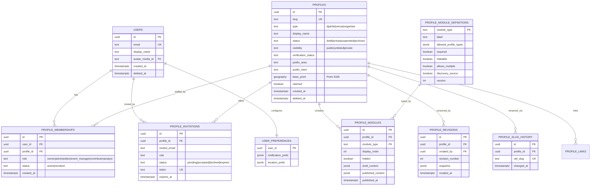
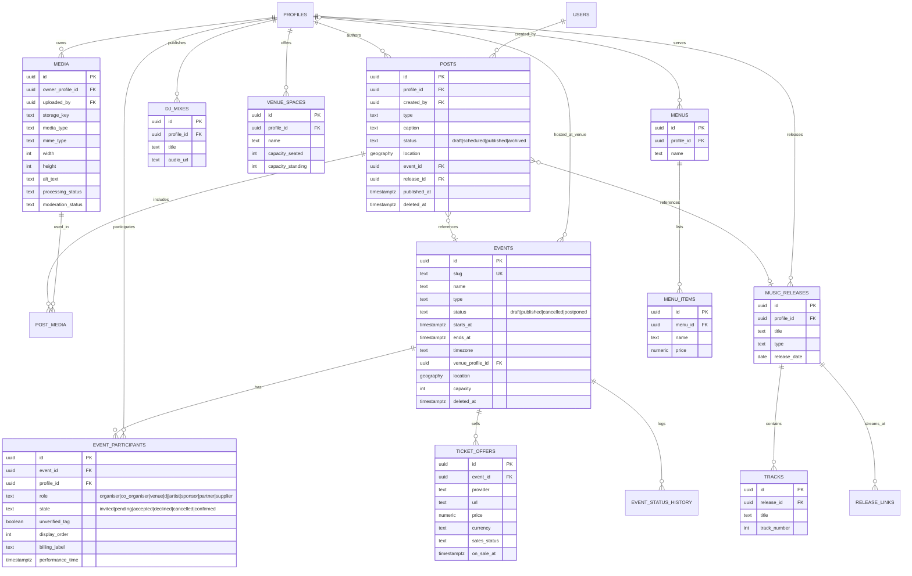
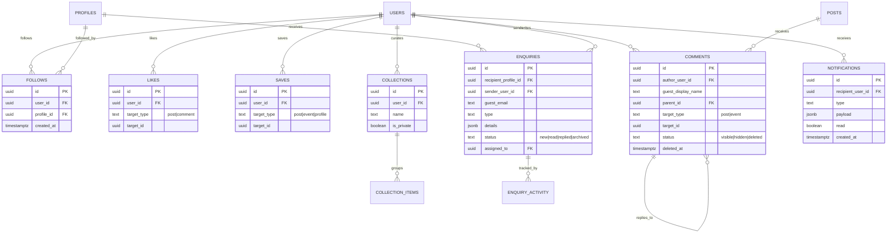
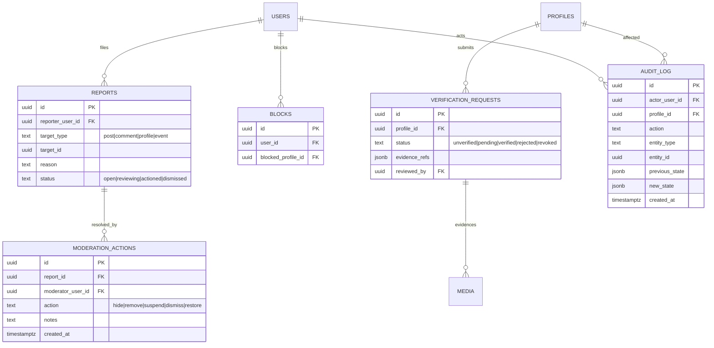

# GigStar Backend Architecture & Data Model — Phase Four Proposal

> **Status: PROPOSAL ONLY.** This document is architecture and planning. Nothing
> in it has been implemented. No database was created, no migration was run, no
> authentication was installed, no environment variable was changed, no API
> route was added, and no deployment occurred. The live prototype (homepage,
> public profiles, profile editor, event pages, location discovery) is
> unchanged. All SQL in the appendix is illustrative and labelled
> **"Proposal only — do not run."**

---

## Table of contents

1. [Existing-system audit](#1-existing-system-audit)
2. [Recommended database & auth stack](#2-recommended-database--auth-stack)
3. [A. Architecture summary](#a-architecture-summary)
4. [B. Entity-relationship diagrams](#b-entity-relationship-diagrams)
5. [C. Table catalogue](#c-table-catalogue)
6. [D. Profile-module storage strategy](#d-profile-module-storage-strategy)
7. [E. Draft & publishing strategy](#e-draft--publishing-strategy)
8. [F. Location strategy](#f-location-strategy)
9. [G. Permission matrix](#g-permission-matrix)
10. [H. Data-classification table](#h-data-classification-table)
11. [Constraints & integrity](#constraints--integrity)
12. [Indexing & search](#indexing--search)
13. [Security boundaries & RLS](#security-boundaries--rls)
14. [API & service boundaries](#api--service-boundaries)
15. [I. Implementation phases & migration plan](#i-implementation-phases--migration-plan)
16. [J. Open decisions](#j-open-decisions)
17. [Architecture Decision Record (ADR)](#architecture-decision-record-adr)
18. [Privacy & data protection](#privacy--data-protection)
19. [Provisional assumptions](#provisional-assumptions)
20. [Appendix: illustrative SQL — Proposal only, do not run](#appendix-illustrative-sql--proposal-only-do-not-run)
21. [Verification checklist](#verification-checklist)

---

## 1. Existing-system audit

Findings from inspecting the current repository. **Do not assume a clean new
project** — a substantial, well-structured mock layer already exists and the
schema below is designed to absorb it, not replace its shapes wholesale.

### Framework, routing & deployment

| Area | Finding |
| --- | --- |
| Framework | **Next.js 16.3.3**, App Router, React 19, TypeScript 5.7.3 |
| Bundler | Turbopack (Next 16 default) |
| Styling | Tailwind CSS v4 (`@import "tailwindcss"`, no `tailwind.config.js`), Base UI (`@base-ui/react`) primitives, `lucide-react` icons |
| Package manager | pnpm 12.3.4 |
| Deployment | Vercel project `gigstar-platform` (team `hiddenbeach`), custom domain `www.gigstar.co.uk`; standard single Next.js app, no separate services |
| Rendering | Server Components read mock modules directly; client components for interactive layers (editor, location controls, follow/save) |

### Data / auth / storage packages present

| Concern | Finding |
| --- | --- |
| Database packages | **None.** No `pg`, `postgres`, `@neondatabase/serverless`, `drizzle-orm`, `@supabase/supabase-js`, `prisma`, or ORM of any kind |
| Authentication packages | **None.** No `better-auth`, `next-auth`/`@auth/*`, `@supabase/ssr`, `@clerk/*` |
| Storage packages | **None.** No `@vercel/blob`, no S3 SDK. Images are static files under `public/images/**` |
| Connected integrations | **Vercel AI Gateway** only (not currently used by app code) |
| Env vars present (names only, no values) | `NEXT_PUBLIC_DEV_SUPABASE_REDIRECT_URL` — a dev-only redirect hint suggesting Supabase auth was *considered*; **no Supabase client, keys, or project is wired** |

**Conclusion:** the backend is greenfield. There is no provider lock-in to design
around, and one latent Supabase breadcrumb but no committed dependency.

### The three coexisting mock data models

This is the most important architectural finding. GigStar currently has **three
independent in-memory/localStorage models**, each serving a different surface:

| # | Location | Shape | Powers | Fate |
| --- | --- | --- | --- | --- |
| 1 | `lib/profiles/showcase/*` | **Rich** model — `ShowcaseProfile` with typed `SectionKey` modules (about, facts, events, releases, audio, videos, gallery, spaces, menu, technical, reviews, partners, mailing-list, featured-event, past-events, related, contact) | Public profiles `/p/[slug]`, the profile editor, four example profiles (Luna Vega, Echo Atlas, The Lumen Rooms, Nightform) | **Canonical source of truth** for the schema below |
| 2 | `lib/discovery/*` | **Flattened** model — `DiscoveryProfile`, `DiscoveryContent`, `DiscoveryEvent`, all carrying `lat`/`lng`/`region`/`town` | Homepage feed + location/radius discovery | Becomes **query projections / views** over the normalised tables |
| 3 | `lib/profiles/types.ts` | **Legacy narrow** model — `Profile` with `ProfileRole[]` and a small `ModuleType` union (mixes/videos/radio/gallery/gigs) | An earlier editor concept, now superseded | **Deprecate**; superseded by the showcase model |

Supporting mock modules: `lib/gigs/*` (gig data/query), `lib/home/*` (feed
derivation), `lib/geo/*` (distance + location resolution), and
`lib/profiles/editor/*` (draft model, module registry, validation, completion,
demo account).

### Existing profile types & module types

- **Profile types (canonical, from showcase model):** `dj`, `artist`, `venue`,
  `organiser`. The discovery model uses the same four. The legacy model's
  `ProfileRole` enum (dj, solo-artist, band, promoter, venue-owner, venue,
  radio-presenter, other) is richer but unused by live pages — treated as a
  future *sub-type/tag*, not a top-level type.
- **Module types (canonical `SectionKey`s):** `about`, `facts`, `events`,
  `past-events`, `featured-event`, `releases`, `audio`, `videos`, `gallery`,
  `spaces`, `menu`, `technical`, `reviews`, `partners`, `mailing-list`,
  `related`, `contact`.
- **Module rules already encoded** in `lib/profiles/editor/module-registry.ts`:
  `about` + `contact` are required and cannot be hidden; `releases` is
  artist-only; `audio`/mixes is dj/artist; `spaces`/`menu`/`technical` are
  venue-only; `partners`/`mailing-list` are organiser-only; `videos` is
  universal. Each entry declares required/recommended, hideable, multi-instance,
  and discovery-feed eligibility — this maps **directly** to
  `profile_module_definitions` below.

### Existing event, content & location models

- **Events** (`lib/profiles/showcase/events.ts`): a **single shared** array of
  `ShowcaseEvent` records referenced by many profiles via `relatedProfiles`
  slug arrays and `lineup` string arrays. This already embodies the "one shared
  event, many promoters" principle the brief demands — the schema simply
  formalises the string references into `event_participants` rows.
- **Content/posts:** `DiscoveryContent` has a `kind` union (photo, clip, mix,
  release, gallery, announcement, poster, lineup, ticket, past-photo, text) and
  *inherits* location from a linked event → venue → profile. This is the seed
  of the `posts` model.
- **Location:** `lib/geo/distance.ts` implements `haversineMiles()` in pure JS;
  `lib/geo/location.ts` resolves the active location from (1) a manual
  town/postcode cookie, (2) a dev-only simulated town, (3) Vercel edge geo
  headers (`x-vercel-ip-latitude/longitude`), using **Postcodes.io** (no API
  key, no paid service) for postcode lookup and reverse geocoding, and
  deliberately stores only a **coarse centroid**, never a raw GPS fix. Radius
  options are 5/10/25/50 miles (default 25). Cookies: `gigstar_location`,
  `gigstar_radius`, `gigstar_dev_town`.

### Existing route patterns

| Pattern | Route | Notes |
| --- | --- | --- |
| Public profile | `/p/[slug]` | Server component → `getShowcaseProfile(slug)` |
| Legacy public profile | `/profile/[slug]` | Legacy model |
| Profile editor | `/profile/[slug]/edit` | Client editor over showcase model, localStorage drafts |
| Profiles index | `/profiles` | Directory |
| Events | `/event/[slug]` | Shared event detail |
| Discovery/home | `/` | Location-aware feed |

No `app/api/**/route.ts` handlers and no `middleware.ts`/`proxy.ts` exist today —
the app is entirely server-component reads over mock data.

### Reuse vs. replace summary

| Keep / reuse | Replace / formalise |
| --- | --- |
| Showcase model **shapes** (become table columns / JSONB payloads) | In-memory arrays → PostgreSQL tables |
| Module registry rules → `profile_module_definitions` seed | localStorage drafts → `profile_modules.draft_content` + revisions |
| Haversine/radius **semantics** & Postcodes.io geocoding | JS distance filter → PostGIS `ST_DWithin` server-side |
| Coarse-location privacy stance | String `relatedProfiles`/`lineup` → `event_participants` rows |
| Four profile types & module taxonomy | Three parallel models → one normalised schema with discovery **views** |
| Route patterns (`/p/[slug]`, `/event/[slug]`, editor) | Static reads → data-access layer + RLS |

---

## 2. Recommended database & auth stack

**The brief says not to overcommit or install.** This is a recommendation with a
clear primary and a documented alternative; the final pick is
[Open Decision OD-1](#j-open-decisions).

### Recommended primary: **Supabase (managed PostgreSQL + PostGIS + Auth + Storage + RLS)**

Rationale, weighted to *this* project's requirements:

- **PostGIS** ships first-class → the location/radius requirements (§F) map to
  `geography(Point,4326)` + `ST_DWithin` with GiST indexes, replacing the JS
  Haversine loop with efficient indexed queries.
- **Auth + RLS together** → the brief's entire "security boundaries" and RLS
  section (public vs account-private vs team-private vs moderator vs sensitive)
  is expressible as Postgres RLS policies keyed on `auth.uid()`, which is the
  single biggest security win for a multi-tenant social platform.
- **Storage** → the media model (§12) needs object storage with per-object
  access rules; Supabase Storage integrates with the same RLS identity.
- **Latent fit** → the existing `NEXT_PUBLIC_DEV_SUPABASE_REDIRECT_URL` env var
  suggests this direction was already anticipated.
- v0 has a first-class Supabase integration and the `supabase-on-vercel` skill
  for correct Next.js 16 session handling.

### Documented alternative: **Neon (serverless PostgreSQL) + Better Auth + Vercel Blob**

- Neon is the v0 default database and excellent (branching, scale-to-zero,
  `pgvector`, and PostGIS available). Better Auth gives email+password with full
  control. Vercel Blob covers media.
- **Trade-off:** there is **no RLS with Better Auth** — every query must be
  manually scoped by `userId`/membership in trusted server code. That is a
  viable and common pattern, but it pushes the security burden entirely into the
  application layer, which is heavier for a platform with this many
  cross-tenant relationships (follows, enquiries, moderation, team membership).

**Recommendation:** default to **Supabase** for the RLS + Auth + Storage +
PostGIS synergy; keep Neon + Better Auth as the fallback if the team prefers
Better Auth's model or wants Neon's branching workflow. Either way, **Postgres is
the engine** and the schema below is provider-neutral standard SQL + PostGIS.

---

## A. Architecture summary

GigStar becomes a **single Next.js application backed by one PostgreSQL
database**, not a fleet of microservices. The design rests on a strict
separation the current prototype does not yet make:

- A **personal account** (`users`) is the only thing that logs in. Humans browse,
  follow, like, save, comment, and *manage* professional identities.
- A **professional profile** (`profiles`) is a public identity (DJ, artist/band,
  venue, organiser). **It is never a login.**
- A **profile membership** (`profile_memberships`) is the many-to-many bridge:
  one account can manage several profiles; one profile can have several team
  members with different roles; ownership can transfer; access can be revoked
  without deleting the profile; invitations can exist before acceptance.

Around that spine sit six domains:

1. **Profile system** — type-driven modular layouts (`profile_module_definitions`
   → `profile_modules`) with draft/published content and revision history;
   plus slug history for safe renames.
2. **Content** — `posts` (typed social posts) and a reusable `media` library;
   posts *reference* structured records (events, releases) rather than copying
   them.
3. **Events** — **one shared `events` record** with `event_participants` capturing
   organiser/venue/DJ/artist/sponsor relationships and their invite→confirm
   lifecycle, so tagging ≠ confirmed billing.
4. **Music, performance & venue detail** — structured child tables
   (`music_releases`, `tracks`, `dj_mixes`, `venue_spaces`, `menus`, …) for the
   entities that must not be buried in JSON.
5. **Social & communication** — `follows`, `likes`, `saves`, `collections`,
   `comments`, `enquiries`, `notifications`.
6. **Trust & safety** — `reports`, `moderation_actions`, `blocks`,
   `verification_requests`, `audit_log`, with soft deletion throughout.

The existing **discovery/homepage** surface is served by **query projections
(SQL views or query functions)** over these normalised tables, preserving the
current `DiscoveryProfile/Content/Event` shapes so the frontend changes as little
as possible during migration.

---

## B. Entity-relationship diagrams

Split into four readable diagrams. Attribute lists are trimmed to keys and the
most load-bearing columns; see the [table catalogue](#c-table-catalogue) for the
full picture.

### B.1 Accounts & profiles



### B.2 Content, media & events



### B.3 Social & communication



### B.4 Moderation, verification & audit



---

## C. Table catalogue

Grouped by domain. **PK** = primary key, **FK** = foreign key, **UK** = unique.
Every user/profile-owned table carries `created_at`; mutable tables add
`updated_at`; user-visible content tables add `deleted_at` for **soft deletion**.

### Accounts & access

| Table | Purpose | Key fields | PK | FKs | Unique | Key indexes | Soft-delete |
| --- | --- | --- | --- | --- | --- | --- | --- |
| `users` | The only login identity. A human. | `email`, `display_name`, `avatar_media_id` | `id` uuid | `avatar_media_id → media` | `email` | `email` | `deleted_at` (anonymise on erasure) |
| `user_preferences` | Per-account settings (notifications, default location). | `notification_prefs` jsonb, `location_prefs` jsonb | `user_id` | `user_id → users` | — | — | cascade with user |
| `profiles` | Public professional identity. Not a login. | `slug`, `type`, `display_name`, `status`, `visibility`, `verification_status`, `public_area`, `public_town`, `base_point`, `private_point`, `claimed` | `id` uuid | `avatar_media_id`, `cover_media_id → media` | `slug` (active) | `type`, `status`, `slug`, GiST `base_point` | `deleted_at` + `status=archived` |
| `profile_memberships` | Account↔profile bridge with role. | `role`, `status` | `id` | `user_id → users`, `profile_id → profiles` | (`user_id`,`profile_id`) active | `profile_id`, `user_id` | `status=revoked` |
| `profile_invitations` | Pending team invites before acceptance. | `invited_email`, `role`, `token`, `expires_at`, `status` | `id` | `profile_id`, `invited_by → users` | `token` | `invited_email`, `profile_id` | expiry-based |

### Profile system

| Table | Purpose | Key fields | PK | FKs | Unique | Key indexes | Soft-delete |
| --- | --- | --- | --- | --- | --- | --- | --- |
| `profile_module_definitions` | Catalogue of module types & rules (seed from `module-registry.ts`). | `module_type`, `label`, `allowed_profile_types` jsonb, `required`, `hideable`, `allows_multiple`, `discovery_source`, `validation_schema` jsonb, `version` | `module_type` | — | `module_type` | — | reference data |
| `profile_modules` | A module instance placed on a profile. | `display_order`, `hidden`, `draft_content` jsonb, `published_content` jsonb, `published_at` | `id` | `profile_id`, `module_type → definitions` | (`profile_id`,`module_type`) when `allows_multiple=false` | `profile_id, display_order` | via profile |
| `profile_revisions` | Point-in-time snapshots for history/restore. | `revision_number`, `snapshot` jsonb, `created_by`, `summary` | `id` | `profile_id`, `created_by → users` | (`profile_id`,`revision_number`) | `profile_id, created_at` | retained |
| `profile_slug_history` | Old slugs → 301 redirects, prevents reuse. | `old_slug`, `changed_at` | `id` | `profile_id` | `old_slug` | `old_slug` | retained |
| `profile_links` | External/social links per profile. | `platform`, `url`, `display_order` | `id` | `profile_id` | (`profile_id`,`platform`,`url`) | `profile_id` | via profile |

### Content & media

| Table | Purpose | Key fields | PK | FKs | Unique | Key indexes | Soft-delete |
| --- | --- | --- | --- | --- | --- | --- | --- |
| `media` | Reusable asset records (one asset, many uses). | `storage_key`, `delivery_url`, `media_type`, `mime_type`, `file_size`, `width`, `height`, `duration`, `alt_text`, `caption`, `credit`, `processing_status`, `moderation_status` | `id` | `owner_profile_id`, `uploaded_by → users` | `storage_key` | `owner_profile_id`, `moderation_status` | `deleted_at` |
| `posts` | Typed social posts referencing structured records. | `type`, `caption`, `status`, `visibility`, `location` geography, `event_id`, `release_id`, `published_at`, `scheduled_at`, `edited_at`, `moderation_status` | `id` | `profile_id`, `created_by → users`, `event_id → events`, `release_id → music_releases` | — | `profile_id, published_at`, `status`, GiST `location` | `deleted_at` |
| `post_media` | Ordered media on a post (M:N). | `display_order` | `id` | `post_id`, `media_id` | (`post_id`,`media_id`) | `post_id` | via post |
| `galleries` / `gallery_items` | Named galleries reusable across profile & posts. | gallery: `name`; item: `display_order`, `media_id` | `id` | `profile_id`; `gallery_id`,`media_id` | — | `profile_id`; `gallery_id` | via owner |
| `tags` / `entity_tags` | Normalised tags + polymorphic join. | `slug`; `target_type`,`target_id`,`tag_id` | `id` | `tag_id → tags` | `tags.slug`; (`target_type`,`target_id`,`tag_id`) | `tag_id`, (`target_type`,`target_id`) | — |
| `profile_mentions` | Profiles mentioned in a post. | — | `id` | `post_id`, `profile_id` | (`post_id`,`profile_id`) | `profile_id` | via post |

### Events

| Table | Purpose | Key fields | PK | FKs | Unique | Key indexes | Soft-delete |
| --- | --- | --- | --- | --- | --- | --- | --- |
| `events` | **One shared** event, never duplicated per promoter. | `slug`, `name`, `type`, `status`, `starts_at`, `ends_at`, `timezone`, `venue_profile_id`, `venue_freetext`, `location` geography, `online_url`, `age_restriction`, `capacity`, `accessibility`, `poster_media_id`, `cancelled_at`, `rescheduled_to` | `id` | `venue_profile_id → profiles`, `poster_media_id → media`, `primary_organiser_id → profiles` | `slug` | `starts_at`, `status`, GiST `location`, `venue_profile_id` | `deleted_at` |
| `event_participants` | Organiser/venue/DJ/artist/sponsor links + lifecycle. Tagging ≠ confirmed. | `role`, `state`, `unverified_tag`, `display_order`, `billing_label`, `performance_time` | `id` | `event_id`, `profile_id` | (`event_id`,`profile_id`,`role`) | `event_id`, `profile_id`, `state` | via event |
| `ticket_offers` | External ticket links now; direct-sale ready later. | `provider`, `url`, `ticket_type`, `price`, `currency`, `sales_status`, `on_sale_at`, `off_sale_at`, `allocation`, `is_free`, `waiting_list` | `id` | `event_id` | — | `event_id`, `sales_status` | via event |
| `event_status_history` | Audit of status/date changes. | `from_status`, `to_status`, `note`, `changed_by` | `id` | `event_id`, `changed_by → users` | — | `event_id` | retained |

### Music, performance & venue detail

| Table | Purpose | Key fields | PK | FKs | Unique | Notes |
| --- | --- | --- | --- | --- | --- | --- |
| `music_releases` | Albums/EPs/singles for artists. | `title`, `type`, `release_date`, `artwork_media_id` | `id` | `profile_id`, `artwork_media_id → media` | — | artist/dj |
| `tracks` | Tracks within a release. | `title`, `track_number`, `duration` | `id` | `release_id` | (`release_id`,`track_number`) | — |
| `release_links` | Streaming/purchase links per release. | `platform`, `url` | `id` | `release_id` | — | — |
| `dj_mixes` | DJ mixes/audio sets. | `title`, `audio_url`, `provider`, `artwork_media_id`, `published_at` | `id` | `profile_id` | — | dj/artist |
| `artist_members` | Band membership + instruments. | `name`, `role`, `member_user_id?` | `id` | `profile_id` | — | optional link to a user |
| `performance_formats` | Bookable formats (DJ set, live band, acoustic…). | `name`, `description`, `duration_options` jsonb | `id` | `profile_id` | — | shared dj/artist |
| `venue_spaces` | Rooms/spaces with independent capacities. | `name`, `capacity_seated`, `capacity_standing`, `description` | `id` | `profile_id` | — | venue |
| `venue_facilities` | Facility flags/notes. | `facility`, `available`, `note` | `id` | `profile_id` | (`profile_id`,`facility`) | venue |
| `venue_opening_hours` | Weekly hours. | `day_of_week`, `opens`, `closes`, `closed` | `id` | `profile_id` | (`profile_id`,`day_of_week`) | venue |
| `venue_technical_details` | Stage/sound/production/curfew/licensing. | `sound_restrictions`, `curfew`, `stage_info`, `production_equipment`, `loading_access`, `licensing` jsonb | `id` | `profile_id` | `profile_id` | venue |
| `menus` / `menu_sections` / `menu_items` | Food & drink for venues. | section `name`,`display_order`; item `name`,`price`,`description`,`dietary` | `id` | chain to `profile_id` | — | venue |

### Social

| Table | Purpose | Key fields | Unique | Notes |
| --- | --- | --- | --- | --- |
| `follows` | Account follows a profile. | `user_id`,`profile_id` | (`user_id`,`profile_id`) | drives follower counts |
| `likes` | Account likes a post/comment (polymorphic). | `user_id`,`target_type`,`target_id` | (`user_id`,`target_type`,`target_id`) | prevents double-like |
| `saves` | Account saves post/event/profile. | `user_id`,`target_type`,`target_id`,`collection_id?` | (`user_id`,`target_type`,`target_id`) | private by default |
| `collections` / `collection_items` | User-curated save groups. | `name`,`is_private`; item `target_type`,`target_id` | items unique per collection | — |
| `comments` | Threaded comments on posts/events. | `author_user_id?`,`guest_display_name?`,`guest_email?`,`parent_id?`,`target_type`,`target_id`,`status` | — | soft delete, depth-capped |
| `comment_likes` | Likes on comments (or fold into `likes`). | `user_id`,`comment_id` | (`user_id`,`comment_id`) | see OD-9 |

### Communication

| Table | Purpose | Key fields | Notes |
| --- | --- | --- | --- |
| `enquiries` | Unified booking/contact enquiries. | `recipient_profile_id`,`sender_user_id?`,`guest_name?`,`guest_email?`,`type`,`details` jsonb,`message`,`status`,`assigned_to?`,`related_event_id?`,`archived_at` | type-specific fields in validated JSONB |
| `enquiry_activity` | Status/assignment/reply timeline. | `enquiry_id`,`actor_user_id`,`action`,`note` | audit of handling |
| `notifications` | Per-account in-app notifications. | `recipient_user_id`,`type`,`payload` jsonb,`read`,`dedup_key` | delivery not built this phase |
| `notification_preferences` | Channel/type opt-ins (or fold into `user_preferences`). | `user_id`,`type`,`in_app`,`email` | see OD-8 |

### Trust & safety

| Table | Purpose | Key fields | Notes |
| --- | --- | --- | --- |
| `reports` | User reports of content/profiles/events. | `reporter_user_id?`,`target_type`,`target_id`,`reason`,`status` | guest reports rate-limited |
| `moderation_actions` | Moderator decisions + notes. | `report_id?`,`moderator_user_id`,`action`,`target_type`,`target_id`,`notes` | append-only |
| `blocks` | Account blocks a profile. | `user_id`,`blocked_profile_id` | unique pair |
| `verification_requests` | Verification workflow + evidence refs. | `profile_id`,`status`,`evidence_refs` jsonb,`reviewed_by?`,`decision_note` | evidence media is **sensitive**, non-public |
| `audit_log` | System-wide audit of important actions. | `actor_user_id?`,`profile_id?`,`action`,`entity_type`,`entity_id`,`previous_state` jsonb,`new_state` jsonb,`request_meta` jsonb | never stores secrets/passwords |

**Entity-group count:** ~48 tables across **9 domains** (accounts/access,
profile system, content, media, events, music/venue detail, social,
communication, trust & safety). Several (`comment_likes`,
`notification_preferences`) are consolidation candidates — see Open Decisions.

---

## D. Profile-module storage strategy

**Recommendation: hybrid — JSONB for presentational module content, normalised
tables for load-bearing structured entities.**

- **`profile_modules.draft_content` / `published_content` are JSONB.** Modules
  like `about`, `facts`, `reviews`, `gallery` ordering, `mailing-list` copy,
  `related`, and layout/config are presentational and vary by type. Storing them
  as validated JSONB avoids a new table per minor module (the brief explicitly
  warns against that) and mirrors the existing showcase `SectionKey` payloads
  almost 1:1, which keeps migration trivial.
- **Important entities are NOT buried in JSON.** `events`, `music_releases`,
  `tracks`, `dj_mixes`, `venue_spaces`, `menus`, and `media` get real tables
  because they are queried, joined, shared across profiles, feed discovery, and
  need constraints/indexes. A module that displays them (e.g. the venue `spaces`
  module) stores only *references/ordering* in JSONB and reads the structured
  rows.
- **`profile_module_definitions` carries a `validation_schema` (JSONB Schema)**
  and a `version`. The application validates `*_content` against it on
  save/publish, so JSONB is *disciplined*, not a free-for-all. Bumping `version`
  enables controlled content migrations.

**Trade-offs:** pure normalisation gives the strongest integrity and query power
but explodes into dozens of thin tables and painful schema churn for cosmetic
tweaks. Pure JSONB is fastest to build but makes cross-profile querying,
constraints, and reporting weak and lets critical records rot inside blobs. The
hybrid keeps *queryable, shared, regulated* data relational and *cosmetic,
per-profile* data flexible — the right balance for GigStar's mix of a rich CMS
and a social/discovery graph.

---

## E. Draft & publishing strategy

**Recommendation: draft + published columns for live state, plus revision
snapshots for history — a hybrid, not full per-edit duplication.**

- Each `profile_modules` row holds **both** `draft_content` and
  `published_content`. Editing mutates only `draft_content`; the public
  `/p/[slug]` render reads `published_content`. This is exactly today's mental
  model (local draft vs. public profile) promoted to the database, so the editor
  migrates cleanly.
- **Publish** copies `draft_content → published_content`, stamps `published_at`,
  and writes **one** `profile_revisions` snapshot (`revision_number`,
  `created_by`, `summary`). Revisions are the history/restore/audit trail
  ("who changed what, when") **without** duplicating the whole profile on every
  keystroke — snapshots are written at publish points (and optionally on manual
  "save checkpoint"), not on every field change.
- **Unpublished changes** = `draft_content` differs from `published_content`
  (a computed "unsaved/unpublished" badge, matching the editor's current dirty
  state).
- **Scheduled publication:** an optional `publish_at` on the module (or a small
  `scheduled_publishes` queue) lets a background job promote drafts at a set
  time.
- **Archive/restore:** archiving sets `profiles.status='archived'` +
  `deleted_at`; restore reverses it. Restoring an old version copies a
  `profile_revisions.snapshot` back into `draft_content` for review before
  re-publish.
- **Preview:** authenticated team members can render `draft_content` via a
  preview flag; the public never sees drafts (enforced by RLS / server checks).

This avoids version-snapshot-on-every-edit bloat while still giving true revision
history where it matters.

---

## F. Location strategy

**Recommendation: PostGIS `geography(Point,4326)` columns with GiST indexes and
`ST_DWithin` radius queries.** This directly replaces the JS Haversine loop in
`lib/geo/distance.ts` with indexed, server-side geospatial queries.

Distinct location roles are modelled separately (the brief insists on this):

| Concept | Where stored | Public? |
| --- | --- | --- |
| Where a **profile is based** | `profiles.base_point` (+ coarse `public_area`/`public_town`) | coarse public; exact private |
| Where a performer will **travel** | `profiles.travel_radius_miles` (+ optional `operating_regions`) | public |
| Where an **event** happens | `events.location` (+ `venue_profile_id`) | public |
| Where a **post's** activity occurred | `posts.location` (inherited from event→venue→profile, as today) | public/coarse |
| Multiple **operating regions** | `profile_regions` (profile ↔ named region/point) | public |
| **Online** events | `events.online_url`, null `location` | public |

**Privacy is preserved from the current design:** store a **coarse public
centroid** (town/area) for display and a separate **exact private coordinate**
only where genuinely required (e.g. a venue's loading access), never exposing raw
browser GPS. Reverse geocoding stays on **Postcodes.io** (no key, no paid
service) exactly as now; PostGIS only changes *how we filter/sort by distance*,
not how we *acquire* coordinates.

Representative queries the design must serve efficiently (all become
`ST_DWithin(col, :point, :meters)` + `ORDER BY col <-> :point`):

- DJs available within 10 mi of Hastings (join `travel_radius`).
- Events within 25 mi of a postcode (`events.location`).
- Venues within 5 mi of Soho (`profiles.type='venue'`).
- Artists performing nearby this weekend (join `event_participants` + `starts_at`).
- Organisers with events in an area.

Miles↔metres conversion happens at the query boundary (radius options remain
5/10/25/50). Because PostGIS is available on both recommended providers, this
strategy is provider-neutral.

---

## G. Permission matrix

**Recommendation: fixed named roles for v1** (simplest to reason about and to
express as RLS), with a `validation_schema`-style permission map kept in code so
granular permissions can be layered later without a schema change. Six roles:

| Action | Owner | Admin | Editor | Event Manager | Contributor | Analyst |
| --- | :---: | :---: | :---: | :---: | :---: | :---: |
| Edit profile identity | ✅ | ✅ | ✅ | ❌ | ❌ | ❌ |
| Edit modules / layout | ✅ | ✅ | ✅ | ❌ | draft only | ❌ |
| Publish content | ✅ | ✅ | ✅ | ❌ | ❌ | ❌ |
| Manage events | ✅ | ✅ | ✅ | ✅ | ❌ | ❌ |
| Respond to enquiries | ✅ | ✅ | ✅ | ✅ | ❌ | ❌ |
| Invite team members | ✅ | ✅ | ❌ | ❌ | ❌ | ❌ |
| Remove team members | ✅ | ✅ | ❌ | ❌ | ❌ | ❌ |
| View analytics | ✅ | ✅ | ✅ | ✅ | ✅ | ✅ |
| Manage verification | ✅ | ✅ | ❌ | ❌ | ❌ | ❌ |
| Archive / delete profile | ✅ | ❌ | ❌ | ❌ | ❌ | ❌ |
| Transfer ownership | ✅ | ❌ | ❌ | ❌ | ❌ | ❌ |

Rules: **at least one active Owner per active profile** (enforced by constraint +
transfer flow); Contributors create draft content but cannot publish; Analyst is
read-only reporting. Platform-level `moderator`/`admin` are **global** roles on
`users`, orthogonal to per-profile membership roles.

---

## H. Data-classification table

| Classification | Examples | Access |
| --- | --- | --- |
| **Public** | Profile display name, slug, type, bio, published modules, public area/town, verified badge, published posts, events, releases, mixes, venue public info, follower/like counts | Anyone, incl. guests |
| **Account-private** | `users.email`, `user_preferences`, a user's saves/collections, notifications, who they follow (if set private), guest→account transfer data | The owning account only |
| **Profile-team-private** | `draft_content`, unpublished modules, enquiries received, enquiry assignments, team membership list, internal notes, analytics, private exact coordinates | Active members of that profile (role-gated) |
| **Moderator-only** | Reports, moderation actions, moderation notes, audit log, block records | Platform moderators/admins |
| **Sensitive** | Verification evidence (IDs, business/venue docs), guest contact emails on enquiries/comments, exact addresses, any raw geolocation | Strictly need-to-know; encrypted at rest where supported; **never public**; short retention |

Guiding rule the brief stresses: **exact personal addresses and raw browser
geolocation must never leak into public profile fields** — they live in separate
private columns/tables with their own access policy.

---

## Constraints & integrity

Database-enforced where possible; application-enforced where noted.

- `users.email` unique (case-insensitive citext or lower() index).
- `profiles.slug` unique among **active** profiles (partial unique index
  `WHERE deleted_at IS NULL`); retired slugs live in `profile_slug_history`
  (also unique) to block reuse and drive 301s.
- `profile_memberships` unique (`user_id`,`profile_id`) among active rows.
- **≥1 active Owner per active profile** — enforced by a trigger/transaction on
  role change + membership removal + ownership transfer (application-level guard
  in addition to DB check).
- `follows` unique (`user_id`,`profile_id`); `likes` unique
  (`user_id`,`target_type`,`target_id`); `saves` similarly — prevents duplicates.
- `event_participants` unique (`event_id`,`profile_id`,`role`).
- **Valid module type for profile type** — CHECK/trigger validating
  `module_type ∈ allowed_profile_types` from `profile_module_definitions`
  (also enforced in app).
- **No duplicate single-instance module** — partial unique
  (`profile_id`,`module_type`) `WHERE allows_multiple=false`.
- Valid `display_order` (non-negative; app keeps contiguous ordering).
- Date ranges: `events.ends_at >= starts_at`; ticket `off_sale_at >= on_sale_at`.
- Non-negative `capacity`, `price`, quantities (CHECK).
- **Comment integrity:** a reply's `parent_id` must share the same
  `target_type`/`target_id` as its parent (trigger).
- **FK deletion behaviour:** prefer `ON DELETE RESTRICT` for shared records
  (events, media) and **soft delete** for user content; cascade only for pure
  child rows (tracks→release, menu_items→menu, post_media→post).
- **Soft-delete rule:** user-visible content sets `deleted_at`; queries filter it
  out; moderators retain visibility for audit.

Application-level validation still required for: JSONB module payload schemas,
enquiry `details` shape per type, business rules (min one owner, invitation
expiry, role capability checks), and rate limiting.

---

## Indexing & search

Proposed indexes tied to real screens (avoiding premature optimisation):

- `profiles(slug)`, `profiles(type, status)`, GiST `profiles(base_point)` —
  profile pages + typed radius discovery.
- `posts(profile_id, published_at DESC)`, `posts(status)`, GiST `posts(location)`
  — profile feeds + nearby content (homepage).
- `events(starts_at)`, `events(status)`, GiST `events(location)`,
  `events(venue_profile_id)` — "events within N mi this weekend".
- `event_participants(event_id)`, `event_participants(profile_id, state)` —
  line-ups + a profile's confirmed appearances.
- `follows(profile_id)` (follower counts), `follows(user_id)` (my feed).
- `comments(target_type, target_id, created_at)` — threaded display.
- `notifications(recipient_user_id, read, created_at DESC)` — unread badge.
- `enquiries(recipient_profile_id, status)` — profile inbox.
- `entity_tags(target_type, target_id)`, `tags(slug)` — tag browse.
- **Full-text search:** `tsvector` GIN indexes on profile name/bio, event
  name/description, post caption (or provider-native search later). Trigram
  (`pg_trgm`) for fuzzy name/slug matching.

The homepage's location feed becomes a single indexed `ST_DWithin` + `ORDER BY
<->` query per entity type, replacing the current in-memory Haversine scan.

---

## Security boundaries & RLS

Required boundaries: **public read**, **personal-account**, **profile-member**,
**profile-owner**, **moderator**, **platform-admin**, plus special handling for
**sensitive verification records**, **guest enquiries**, and **media uploads**.

**If Supabase (recommended):** use Postgres **RLS** keyed on `auth.uid()`:

- Public tables (`profiles`, published `posts`, `events`, releases, etc.) — a
  `SELECT` policy allowing anyone where `status/visibility` is public and
  `deleted_at IS NULL`.
- Team-private data (`profile_modules.draft_content`, `enquiries`) — policies
  that check an active `profile_memberships` row for `auth.uid()` with a
  sufficient role (via a `SECURITY DEFINER` helper like `is_profile_member(pid,
  min_role)`).
- Account-private (`saves`, `notifications`, `user_preferences`) — `user_id =
  auth.uid()`.
- Moderator/admin — a global-role claim/allow-list; sensitive verification
  evidence readable only by reviewers.
- Media uploads — Storage bucket policies mirroring `media.owner_profile_id`
  membership; sensitive verification bucket private.

**If Neon + Better Auth (alternative):** there is **no RLS**; every query runs in
trusted server code that must **explicitly scope by `auth` session +
membership** on every read/write. Same boundaries, enforced in a data-access
layer instead of the database. (This is the main reason Supabase is recommended
for this particular app.)

Policies are **not implemented in this phase** — this is the design only.

---

## API & service boundaries

**Stay a single Next.js app** (no microservices for v1). Map operations to the
lightest suitable mechanism:

| Domain | Mechanism | Notes |
| --- | --- | --- |
| Authentication | Provider SDK + middleware/session | Supabase Auth or Better Auth |
| Public discovery (home, search, profile/event reads) | **Server Components** + cached data-access functions (or SQL views) | read-only, cache-friendly |
| Profile management (edit modules, team, settings) | **Server Actions** | mutations from the editor UI |
| Publishing (promote draft, snapshot revision, schedule) | **Server Actions** + a **background job** for scheduled publishes | |
| Events (create/update, participants, tickets) | **Server Actions** | invite→confirm lifecycle |
| Social (follow/like/save/comment) | **Server Actions** (+ optimistic UI) | RLS/scoping enforced |
| Enquiries | **Server Action** to create; **background job** for email later | delivery deferred |
| Media | **Route Handler** for signed-upload URLs; **background job** for transcode/thumbnails later | direct-to-storage uploads |
| Notifications | **Background jobs** (fan-out) + read/ack Server Actions | delivery deferred |
| Moderation | **Server Actions** (moderator-gated) | append-only actions |
| Ticketing | External links now (data only); **Webhooks** later for direct sales | isolated future subsystem |

Direct database access is confined to **trusted server code** (Server
Components/Actions/Route Handlers); the browser never talks to the DB directly
(except Supabase's RLS-guarded client for realtime, if adopted later).

---

## I. Implementation phases & migration plan

The brief's suggested order is sound; I recommend two adjustments, marked
**(changed)**. The **live prototype stays usable throughout** — new tables are
read via a data-access layer that can fall back to mock modules per surface until
each is cut over.

0. **(added) Provider decision & schema authoring** — resolve OD-1, enable
   PostGIS, author the schema + seed `profile_module_definitions` from the
   existing module registry. No app behaviour change.
1. **Create production schema** (tables, constraints, indexes; RLS policies if
   Supabase).
2. **Seed the four example profiles** from the showcase model (Luna Vega, Echo
   Atlas, The Lumen Rooms, Nightform) — a deterministic seed mirroring current
   data.
3. **Seed shared example events** from `SHOWCASE_EVENTS`, converting
   `relatedProfiles`/`lineup` strings into `event_participants`.
4. **Connect public profile reads** — point `/p/[slug]` and `/event/[slug]` at
   the DB behind a flag; keep mock fallback until verified.
5. **(changed) Establish account authentication *before* editor drafts** — the
   editor's drafts, revisions, and "who changed what" need a real
   `auth.uid()`/membership. Doing auth here (rather than at step 8) means step 6
   can persist true team-scoped drafts instead of re-keying anonymous
   localStorage later.
6. **Connect profile editor drafts** — move localStorage drafts to
   `profile_modules.draft_content`, gated by `profile_memberships`.
7. **Add publishing** — draft→published promotion + `profile_revisions`.
8. **Connect homepage discovery** — replace the in-memory Haversine feed with
   PostGIS `ST_DWithin` views/queries; retire the flattened discovery arrays.
9. **Add social actions** — follows/likes/saves/comments with guest→account
   transfer.
10. **Add enquiries & notifications** — enquiry capture + in-app notifications
    (email/push delivery later).
11. **(added) Trust & safety + verification** — reports, moderation, blocks,
    verification workflow, audit log.

Guest support (anonymous browser ID → transfer on registration), ticketing
webhooks, media transcoding, and notification delivery are explicitly **later**.

---

## J. Open decisions

Decisions that could **fundamentally** change the schema are flagged; per the
brief I have made provisional assumptions and kept the model changeable rather
than stopping.

| # | Decision | Provisional assumption | Why it matters |
| --- | --- | --- | --- |
| **OD-1** | **Provider & auth: Supabase vs Neon+Better Auth** | Supabase (RLS+Auth+Storage+PostGIS) | Schema is portable, but **RLS vs app-scoped security** changes how policies are built. *Confirm before Phase 1.* |
| **OD-2** | Anonymous comments in v1? | **Off** for v1 (account or verified-guest only) — reduces spam/moderation load | Affects `comments` guest columns + rate limiting |
| **OD-3** | Fixed roles vs granular permissions | **Fixed 6 roles** for v1 | Granular later without schema change (permission map in code) |
| **OD-4** | Module content: how strict is JSONB validation? | JSON Schema per definition, versioned | Governs migration tooling |
| **OD-5** | Revision snapshots: at publish only, or also manual checkpoints? | **Publish + optional manual checkpoint** | Storage growth vs history granularity |
| **OD-6** | Scheduled publishing needed at launch? | **Deferred** (columns reserved) | Adds a background job |
| **OD-7** | Direct ticketing timeline | **External links only** for v1 | Keeps payments a separate future subsystem |
| **OD-8** | `notification_preferences` separate vs inside `user_preferences` | **Inside `user_preferences`** initially | Minor; consolidation |
| **OD-9** | `comment_likes` separate vs folded into polymorphic `likes` | **Fold into `likes`** (`target_type='comment'`) | Fewer tables |
| **OD-10** | Guest identity mechanism | Anonymous browser ID + consented cookie, **transfer on signup**; not built now | Privacy + dedup design |
| **OD-11** | Legacy `lib/profiles/types.ts` model | **Deprecate**; migrate any usage to showcase model | Avoids a 4th data model |
| **OD-12** | Full-text search: Postgres FTS vs external | **Postgres FTS + pg_trgm** for v1 | External search later if needed |

---

## Architecture Decision Record (ADR)

Concise records for the load-bearing choices. Format: Decision · Reason ·
Alternative · Trade-off · Consequences.

**ADR-1 — Personal accounts separated from professional profiles.**
Decision: only `users` log in; `profiles` are public identities.
Reason: a human may run several acts/venues, and acts have teams.
Alternative: one account = one profile (login per DJ/venue).
Trade-off: an extra membership join on every authz check.
Consequences: clean multi-profile management, team access, ownership transfer;
no per-type auth tables.

**ADR-2 — Many-to-many profile membership with fixed roles.**
Decision: `profile_memberships(user, profile, role)`.
Reason: teams, delegation, revocation, invitations, ≥1 owner rule.
Alternative: single `owner_id` column on `profiles`.
Trade-off: more relational plumbing + the "one owner" invariant to enforce.
Consequences: real collaboration; RLS/scoping keyed on membership.

**ADR-3 — One shared event record.**
Decision: single `events` row; promoters attach via `event_participants`.
Reason: the mock already shares events via `relatedProfiles`; duplication causes
divergent data.
Alternative: per-profile event copies.
Trade-off: participant lifecycle + approval logic.
Consequences: consistent event pages, accurate line-ups, tagging ≠ confirmation.

**ADR-4 — Structured posts reference events/releases.**
Decision: `posts.event_id`/`release_id` FKs, not embedded copies.
Reason: avoid duplicating structured records inside every post.
Alternative: denormalise event/release into post JSON.
Trade-off: joins to render a post.
Consequences: single source of truth; edits propagate.

**ADR-5 — Hybrid module storage (JSONB + relational).**
Decision: JSONB for presentational module content; tables for shared/queried
entities.
Reason: avoid a table per cosmetic module while keeping events/media/releases
queryable.
Alternative: fully normalised, or fully JSONB.
Trade-off: two mental models; JSONB needs app-side schema validation.
Consequences: fast module iteration + strong integrity where it counts.

**ADR-6 — Draft/published columns + revision snapshots.**
Decision: per-module `draft_content`+`published_content`; snapshots at publish.
Reason: matches today's draft-vs-public model; gives history without per-edit
bloat.
Alternative: full profile snapshot per edit, or draft-only.
Trade-off: publish step manages two payloads.
Consequences: safe editing, previews, restore, audit of who/when.

**ADR-7 — PostGIS geography for location.**
Decision: `geography(Point,4326)` + `ST_DWithin` + GiST.
Reason: replaces JS Haversine with indexed radius queries at scale.
Alternative: plain lat/lng columns with app-side Haversine.
Trade-off: PostGIS dependency/extension.
Consequences: efficient "within N miles" across profiles/events/posts; same
Postcodes.io acquisition + coarse-location privacy retained.

**ADR-8 — Soft deletion.**
Decision: `deleted_at` on user-visible content; hard-delete only pure children.
Reason: moderation, audit, accidental-deletion recovery, UK data requests.
Alternative: hard delete everywhere.
Trade-off: every query must filter `deleted_at`.
Consequences: distinguishes owner-deleted vs manager-hidden vs platform-removed
vs audit-retained.

**ADR-9 — External ticketing first.**
Decision: `ticket_offers` = external links now; direct sales isolated later.
Reason: fastest path; no payments ledger yet.
Alternative: build direct ticketing/payments now.
Trade-off: no in-house checkout at launch.
Consequences: events link out; a clean seam for a future ticketing subsystem.

**ADR-10 — Guest access, transfer on signup.**
Decision: guests browse and (optionally) act via an anonymous browser ID,
transferred to the account on registration; not built this phase.
Reason: keep the public site open without forcing accounts.
Alternative: require login for any interaction.
Trade-off: dedup + privacy + expiry logic.
Consequences: low-friction guests, clean later migration of their actions.

**ADR-11 — Moderation boundaries with global roles.**
Decision: platform moderator/admin roles on `users`, separate from per-profile
roles; append-only `moderation_actions` + `audit_log`.
Reason: separate platform trust&safety from profile team management.
Alternative: overload profile roles for moderation.
Trade-off: a second authorization axis.
Consequences: clear public/owner/moderator/admin boundaries; auditable actions.

---

## Privacy & data protection

UK data-protection (UK GDPR) considerations — **flagged for professional legal
review, not legal advice**:

- **Data minimisation:** store coarse public location; keep exact coordinates and
  addresses in private columns/tables only when necessary.
- **Sensitive data:** verification evidence and guest contact details are
  restricted, short-retention, and never public; store in a private storage
  bucket with strict policies.
- **Lawful basis & consent:** marketing/mailing-list opt-ins are
  consent-controlled and separable; guest tracking requires a consent mechanism.
- **Right to erasure/anonymisation:** `users.deleted_at` triggers anonymisation
  (strip email/PII, keep aggregate/audit references) rather than breaking
  referential integrity.
- **Data export (portability):** design read paths that can assemble a user's
  data on request.
- **Retention:** define retention windows for audit logs, guest enquiries,
  moderation records.
- **No secrets in audit:** `audit_log` never records passwords/tokens; only
  necessary before/after state.

**Areas requiring professional privacy/legal review:** guest tracking &
cookie consent, verification-document handling, retention periods, and
international data transfer if the provider region is outside the UK/EU.

---

## Provisional assumptions

Recorded per the brief (design remains changeable; see Open Decisions):

1. Four launch profile types (dj, artist, venue, organiser); additional types can
   be added via `profile_module_definitions.allowed_profile_types` without
   touching the account system.
2. UK-first (postcodes, Postcodes.io, miles) — model stores metres/`geography`
   so it generalises internationally.
3. Email+password is the primary auth method (no social/OAuth unless requested).
4. Supabase is the provisional provider (OD-1).
5. Anonymous comments off for v1 (OD-2); fixed roles for v1 (OD-3).
6. External ticket links only for v1 (OD-7); notification/email/push delivery
   deferred.
7. The legacy narrow profile model is deprecated in favour of the showcase model
   (OD-11).

---

## Appendix: illustrative SQL — Proposal only, do not run

> **PROPOSAL ONLY — DO NOT RUN.** This is a non-executable sketch to make the
> design concrete. It is **not** a migration, is intentionally partial, omits
> most policies/indexes, and must not be applied to any database in this phase.

```sql
-- Proposal only — do not run.
-- create extension if not exists postgis;

-- create type profile_type as enum ('dj','artist','venue','organiser');
-- create type profile_status as enum ('draft','active','suspended','archived');
-- create type membership_role as enum
--   ('owner','admin','editor','event_manager','contributor','analyst');

-- users: the only login identity
-- create table users (
--   id uuid primary key default gen_random_uuid(),
--   email citext not null unique,
--   display_name text not null,
--   avatar_media_id uuid references media(id),
--   created_at timestamptz not null default now(),
--   deleted_at timestamptz
-- );

-- profiles: public professional identity (never a login)
-- create table profiles (
--   id uuid primary key default gen_random_uuid(),
--   slug text not null,
--   type profile_type not null,
--   display_name text not null,
--   status profile_status not null default 'draft',
--   visibility text not null default 'public',
--   verification_status text not null default 'unverified',
--   public_area text, public_town text,
--   base_point geography(Point,4326),
--   private_point geography(Point,4326),   -- sensitive, never public
--   travel_radius_miles int,
--   claimed boolean not null default false,
--   created_at timestamptz not null default now(),
--   updated_at timestamptz not null default now(),
--   deleted_at timestamptz
-- );
-- create unique index profiles_slug_active
--   on profiles (slug) where deleted_at is null;
-- create index profiles_type_status on profiles (type, status);
-- create index profiles_base_point_gix on profiles using gist (base_point);

-- membership bridge (many-to-many, with the "≥1 owner" invariant in app+trigger)
-- create table profile_memberships (
--   id uuid primary key default gen_random_uuid(),
--   user_id uuid not null references users(id),
--   profile_id uuid not null references profiles(id),
--   role membership_role not null,
--   status text not null default 'active',
--   created_at timestamptz not null default now()
-- );
-- create unique index memberships_unique_active
--   on profile_memberships (user_id, profile_id) where status = 'active';

-- module definitions (seed from lib/profiles/editor/module-registry.ts)
-- create table profile_module_definitions (
--   module_type text primary key,
--   label text not null,
--   allowed_profile_types jsonb not null,
--   required boolean not null default false,
--   hideable boolean not null default true,
--   allows_multiple boolean not null default false,
--   discovery_source boolean not null default false,
--   validation_schema jsonb,
--   version int not null default 1
-- );

-- module instances (hybrid: JSONB draft/published content)
-- create table profile_modules (
--   id uuid primary key default gen_random_uuid(),
--   profile_id uuid not null references profiles(id),
--   module_type text not null references profile_module_definitions(module_type),
--   display_order int not null default 0,
--   hidden boolean not null default false,
--   draft_content jsonb not null default '{}',
--   published_content jsonb,
--   published_at timestamptz,
--   created_at timestamptz not null default now(),
--   updated_at timestamptz not null default now()
-- );
-- create unique index modules_single_instance
--   on profile_modules (profile_id, module_type)
--   where (select allows_multiple from profile_module_definitions d
--          where d.module_type = profile_modules.module_type) = false;

-- one shared event; promoters attach via participants
-- create table events (
--   id uuid primary key default gen_random_uuid(),
--   slug text not null unique,
--   name text not null,
--   type text, status text not null default 'draft',
--   starts_at timestamptz not null,
--   ends_at timestamptz,
--   timezone text not null default 'Europe/London',
--   venue_profile_id uuid references profiles(id),
--   location geography(Point,4326),
--   capacity int check (capacity is null or capacity >= 0),
--   deleted_at timestamptz,
--   check (ends_at is null or ends_at >= starts_at)
-- );
-- create index events_starts_at on events (starts_at);
-- create index events_location_gix on events using gist (location);

-- example radius query (replaces JS Haversine):
-- select p.* from profiles p
-- where p.type = 'venue' and p.deleted_at is null
--   and ST_DWithin(p.base_point, ST_MakePoint(:lng,:lat)::geography, :meters)
-- order by p.base_point <-> ST_MakePoint(:lng,:lat)::geography
-- limit 50;
```

---

## Verification checklist

Confirmed for this phase:

- ✅ **No production code altered** — only this new `docs/` file was created; no
  files under `app/`, `components/`, or `lib/` were modified.
- ✅ **No database created**, **no migration run**, **no schema executed** (SQL is
  a commented, non-executable proposal).
- ✅ **No authentication installed or connected** — no auth packages added.
- ✅ **No environment-variable value exposed or changed** — only the *name*
  `NEXT_PUBLIC_DEV_SUPABASE_REDIRECT_URL` is referenced.
- ✅ **No API route created** — no `app/api/**/route.ts`, no `middleware.ts`.
- ✅ **No deployment occurred** in this phase.
- ✅ **Existing pages still build** — no source changes, so the homepage,
  public profiles, editor, event pages, navigation, mock data, and localStorage
  drafts are byte-for-byte unchanged.
- ✅ **Documentation covers all required areas** (deliverables A–J, ADR,
  constraints, indexing, RLS, service boundaries, privacy, migration).
- ✅ **Diagrams use valid Mermaid ER syntax** and are split for readability.
- ✅ **Table relationships are internally consistent** with the ER diagrams and
  the existing showcase/discovery/event models.
- ✅ **The proposed architecture supports the existing homepage (location
  discovery), public profiles, and the editor** via projections/views and the
  draft/published module model.
